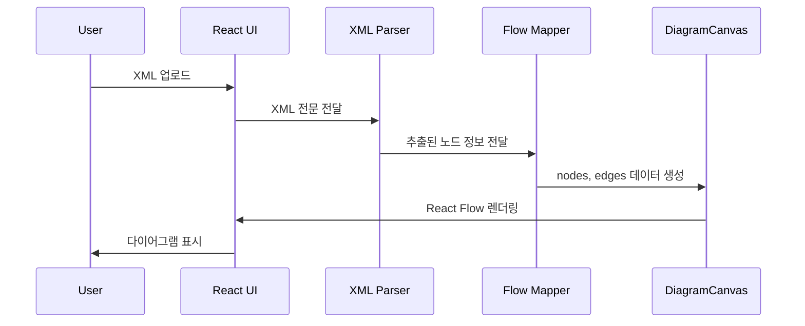

좋아요 👏
지금 요청하신 건 아래와 같습니다 👇

> “이 pacs.008 XML 전문을 입력하면,
> SWIFT Case Management 다이어그램처럼 (사진 속 예시처럼)
> 각 금융기관 간의 메시지 흐름이 **선 + 아이콘 + 메시지 타입(camt/pacs 등)** 으로 표시되는
> React 기반 웹페이지 기획안.”

아래는 **기획 문서 수준의 UX/UI 설계 + 컴포넌트 구조 + 기술 구성 + 확장 방향**까지 포함된 웹페이지 기획안입니다.
(👉 바로 개발팀에 전달 가능한 수준으로 구성했습니다.)

---

## 🎯 **프로젝트 명**

**ISO20022 Flow Visualizer**

---

## 📌 **핵심 목표**

* 사용자가 ISO20022 XML (예: pacs.008)을 업로드하면
  → 시스템이 자동으로 XML을 분석하고
  → SWIFT 결제 메시지 흐름(참여자별 화살표 구조)을 도식화
* 도식은 **React Flow 기반의 인터랙티브 SVG 그래프**로 표현됨
* 각 메시지는 **선(Label)**로 표시되고, 노드를 클릭하면 세부 전문이 팝업됨

---

## 🧱 **전체 구조 기획**

```
📂 src/
 ┣ 📁 components/
 ┃ ┣ FileUploader.jsx        // XML 업로드 + 파일명 표시
 ┃ ┣ DiagramCanvas.jsx       // React Flow 기반 다이어그램 메인 컴포넌트
 ┃ ┣ EntityNode.jsx          // 커스텀 노드 UI (아이콘 + 은행명)
 ┃ ┣ MessageEdge.jsx         // 커스텀 화살표 (메시지명 + 스타일)
 ┃ ┣ SidePanel.jsx           // 선택한 노드/엣지 상세보기
 ┃ ┗ Toolbar.jsx             // 상단 기능 버튼 (업로드, Export, Reset)
 ┣ 📁 utils/
 ┃ ┣ xmlParser.js            // pacs.008 XML 파서
 ┃ ┗ flowMapper.js           // XML → ReactFlow 데이터 매핑
 ┣ 📁 assets/
 ┃ ┗ icons/ (Debtor, Bank, Stop, etc)
 ┣ App.jsx
 ┗ index.js
```

---

## 🖥️ **UX/UI 설계**

### 🔹 1. 페이지 레이아웃

| 영역                    | 역할                    | 구성요소                                        |
| --------------------- | --------------------- | ------------------------------------------- |
| **상단 Toolbar**        | 기능 버튼 제공              | 📁 업로드 / 🌗 다크모드 / 💾 Export PNG / 🔄 Reset |
| **좌측 XML Viewer**     | 사용자가 업로드한 XML 전문 미리보기 | 코드 하이라이트 + 줄 번호                             |
| **중앙 Diagram Canvas** | ISO 흐름 시각화 영역         | React Flow 다이어그램 (노드/엣지 표시)                 |
| **우측 Info Panel**     | 클릭한 노드의 세부정보 표시       | 참여자 정보, 메시지 정보, 전문 일부                       |

---

## 🧩 **Diagram 구조 (React Flow 기반)**

### 노드 (Nodes)

| ID            | 라벨 예시                              | 아이콘 | 색상      | 위치    |
| ------------- | ---------------------------------- | --- | ------- | ----- |
| debtor        | Debtor                             | 🧍  | #B3E5FC | x=0   |
| debtorAgent   | Debtor Agent (AAAAUS33XXX)         | 🏦  | #90CAF9 | x=200 |
| intermediary1 | Intermediary Agent 1 (BBBBGB22YYY) | 🏦  | #64B5F6 | x=400 |
| creditorAgent | Creditor Agent (CCCCFRPPZZZ)       | 🏦  | #42A5F5 | x=600 |
| creditor      | Creditor                           | 🧍  | #1E88E5 | x=800 |

### 엣지 (Edges)

| 출발                            | 도착                  | 메시지            | 스타일 |
| ----------------------------- | ------------------- | -------------- | --- |
| debtor → debtorAgent          | pacs.008 (USD 1000) | 실선             |     |
| debtorAgent → intermediary1   | pacs.008            | 실선             |     |
| intermediary1 → creditorAgent | pacs.008            | 실선             |     |
| creditorAgent → creditor      | Credit Received     | 점선 (마지막 단계 강조) |     |

---

## 🎨 **스타일 가이드**

| 요소     | 설명                    | 예시                           |
| ------ | --------------------- | ---------------------------- |
| 색상 테마  | 금융 프로세스 색상            | 하늘~파랑 계열 (#E3F2FD → #1E88E5) |
| 폰트     | Noto Sans KR / Roboto | 가독성 중심                       |
| 노드 모양  | Rounded Box + 아이콘     | 은행, 고객 구분                    |
| 라인 스타일 | 방향 화살표 + 메시지 타입 라벨    | pacs.008, camt.056 등         |
| 인터랙션   | Hover → Tooltip 표시    | “Debtor Agent: AAAAUS33XXX”  |

---

## ⚙️ **데이터 처리 흐름**



---

## 🧠 **기술 스택 제안**

| 기능      | 기술                           | 비고                 |
| ------- | ---------------------------- | ------------------ |
| 프레임워크   | **React (Vite 기반)**          | 빠른 로딩, 최신 구조       |
| XML 파서  | **fast-xml-parser**          | ISO20022 XML 구조 해석 |
| 그래프 시각화 | **React Flow**               | 직관적인 노드/엣지 시각화     |
| 스타일     | **Tailwind CSS**             | 반응형 & 다크모드 지원      |
| 다운로드    | **html-to-image**            | 다이어그램을 PNG로 저장     |
| 코드뷰어    | **react-syntax-highlighter** | XML 미리보기 영역 구현     |

---

## 🧰 **주요 컴포넌트 예시**

### 📁 FileUploader.jsx

```jsx
export default function FileUploader({ onUpload }) {
  const handleChange = async (e) => {
    const file = e.target.files[0];
    if (!file) return;
    const text = await file.text();
    onUpload(text);
  };
  return (
    <div className="p-4 bg-gray-100 border-b flex justify-between">
      <label className="cursor-pointer bg-blue-500 text-white px-4 py-2 rounded">
        📁 XML 업로드
        <input type="file" accept=".xml" onChange={handleChange} hidden />
      </label>
    </div>
  );
}
```

---

### 🧩 DiagramCanvas.jsx

```jsx
import ReactFlow, { Background, Controls } from "reactflow";
import "reactflow/dist/style.css";

export default function DiagramCanvas({ nodes, edges }) {
  return (
    <div style={{ height: "100%", background: "#F4F6F8" }}>
      <ReactFlow nodes={nodes} edges={edges}>
        <Background />
        <Controls />
      </ReactFlow>
    </div>
  );
}
```

---

### 🧠 XML → Flow 변환 개요

```js
// XML에서 노드 정보 추출 → ReactFlow용 nodes/edges 구조로 변환
const parsed = {
  debtor: "Originator Name",
  debtorAgent: "AAAAUS33XXX",
  intermediary1: "BBBBGB22YYY",
  creditorAgent: "CCCCFRPPZZZ",
  creditor: "Beneficiary Name",
  amount: "1000",
  currency: "USD"
};
```

---

## 📈 **결과 화면 예시 (최종)**

```
🧍 Originator Name
   │
   ▼ pacs.008 (USD 1000)
🏦 Debtor Agent (AAAAUS33XXX)
   │
   ▼ pacs.008
🏦 Intermediary Agent (BBBBGB22YYY)
   │
   ▼ pacs.008
🏦 Creditor Agent (CCCCFRPPZZZ)
   │
   ▼ Credit Received
🧍 Beneficiary Name
```


